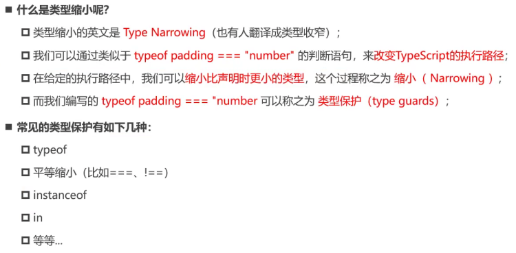

## 数组类型声明

```javascript
const arr: string[] = ['aaa', 'bbb', 'ccc']
const arr: Array<number> = ['111', '222', '333']
```

## 对象类型声明

```javascript
// 属性与类型一一对应
let info: {
  age: number
  message: string
} = {
  age: 18,
  message: 'kobe'
}
```

## 函数类型声明

```javascript
function sum(sum1: number, sum2: number): number {
  return sum1 + sum2
}
// 匿名函数一般没必要添加类型注解，会根据上下文自动推导。称为上下文类型。
```

## any 类型与 unknown 类型

```javascript
// any 代表可以做任何操作
// unknown 类型 做任何操作都是违法的
let a: any = 123
a = 'abc' // 可以操作

let b: unknown = 'aaa'
console.log(b.length) // 操作不允许 需要校验具体类型过后才可以
if (typeof b === 'string') {
  console.log(b.length) // 校验过类型是 string 可以操作
}
// unknown 经过校验缩小类型可以操作，也称之为 类型缩小
```

## void 类型

```javascript
// viod 类型 函数没有任何返回值时，他的返回值类型就是viod类型
type FooType = () => viod
function foo: FooType = () => {

}
// 函数明确返回值类型为viod类型时，必须不return 或者 返回undefined类型，推导出返回类型为void的时候，可以返回任意类型。
```

## never 类型

```javascript
// 永远不会发生值的类型
```

## tuple 元组类型

```javascript
// 元组会将类型一一对应存储，元组可以放置不同的数据类型，取出值会有明确类型。
const info: [string, number, number] = ['abc', 123, 456]

// 数组一般存放相同数据类型，元组可以存放不同数据类型且不会造成数据类型不明确。
```

## 联合类型

```javascript
// 多个基本类型联合
function foo(id: string | number) {}
```

## 交叉类型

```javascript
// 表示需要同时满足左右的类型 使用 & 连接
type newType = string | number // 错误示范，此时newTpe为never类型。

// 一般交叉两个对象类型使用
interface iKun {
  name：string
  age: number
}

interface iKun2 {
  coding: () => viod
}

const person: iKun & iKun2 = {
  name: 'code',
  age: 18,
  coding: () => {
    // ...
  }
}
```

## 类型别名

```javascript
// 使用type给多种类型起一个别名，方便复用
type MyNumber = string | number
function getId(ids: MyNumber) {}
```

## 接口的声明

```javascript
// 使用interface声明类型
interface person {
  age: number
  name: string
}

总结：如果是非对象类型声明建议使用type，如果是对象类型声明建议使用interface
```

## 类型断言

```javascript
// 类型断言可以再ts无法推导具体类型但是我们明确知道是什么类型时，将它转变为我们确定的类型。
// 获取DOM元素 
const myEl = document.getElementById('my-img') as HTMLImageElement
// 确定img元素存在且可以拿到，可以断言为HTMLImageElement类型
myEl.src = 'xxx'

// as 只能断言为更为具体的类型或者不太具体的类型
const age: number = 18
const age1 = age as any
// ----------------------
const age2 = age1 as string
console.log(age.split(" "))


// 扩展 非空类型断言 在访问某个属性时确定有值加入 ！ 使ts不在检测
interface person {
  age: number
  name?: string
}
const iKun: person = {
  age: 19
}
// 使用 非空类型断言 强制ts不在检测（危险行为，除非确定一定有，否则这么写）
iKun!.name = 'kobe'


```

## 字面量类型

```javascript
// 示例 kobe 字面量就是name的类型
const name: 'kobe' = 'kobe'

// 将多个字面量联合起来
type Direction = 'up' | 'down' | 'left' | 'right'
let d: Direction = 'up'
// d = 'aaa' 不允许，必须是字面量中的某一个

// 应用示例
type methodType = 'get' | 'post'
function request(url: string, method: methodType) {}
// 要求第二个参数传入必须是 get 或者 post
```

## 类型缩小


