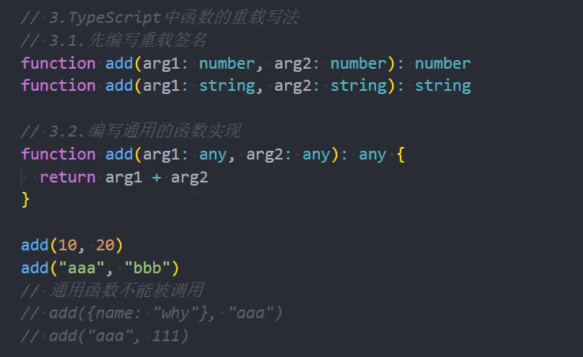

## 函数类型

```javascript
// 定义函数的类型
// 1.使用函数类型表达式来定义
type fooType = (arg: number) => number
function foo: fooType(arg: number) {
  return arg
}
// 2.函数的调用签名来表达
interface barType {
  name: string
  // 表示该函数可以被调用，调用签名方式表达
  (arg: number): number
}
function bar: barType(arg: number) {
  return arg
}
bar.name = 'bar'
bar(123)
```

> tips: 如果只是描述函数本身，使用函数表达式定义类型，如果将函数看作对象来描述，使用函数的调用签名来定义类型。

## 函数的重载



## 类的使用

### ts 声明类

```javascript
// 使用class
class Person {
  // 必须先声明才能使用
  name: string
  age: number
  constructor(name: string, age: number) {
    this.name = name
    this.age = age
  }
}
const p1 = new Person('kobe', 18)
```

> 类的修饰符：public 表示公共的都可以访问默认就是 public，private 表示私有只有在类中可以访问实例中访问不到，protected 只有在当前类或者继承后的子类可以访问实例中不可访问。

### 类的 setter 和 getter

```javascript
// 类中有private私有成员时，可以使用setter和getter来访问和修改
class Person {
  // 必须先声明才能使用
  private _name: string
  age: number
  constructor(name: string, age: number) {
    this._name = name
    this.age = age
  }

  // setter 方法来设置值
  set _name(newValue: string) {
    this.name = newValue
  }
  // getter方法来获取值
  get name(): string {
    return this._name
  }
}
const p1 = new Person('kobe', 18)
```

### 参数属性

```javascript
// 在构造函数参数前添加一个可见性修饰符来创建参数属性，在类属性被创建之后会直接得到这些修饰符。
class Person {
  // 必须先声明才能使用
  name: string
  age: number
  constructor(public name: string, private age: number) {
    this.name = name
    this.age = age
  }
}
const p1 = new Person('kobe', 18)
```

### 抽象类 abstract

```javascript
abstract class Shape {
  // getArea 方法只有声明没有实现体
  // 子类在new的时候必须实现该抽象方法
  // 抽象方法必须在抽象类当中，且都必须加abstract关键字
  abstract getArea()
}

// 子类必须实现抽象类的抽象方法
class Rectangle extends Shape {
  constructor(public width: string, height age: number) {
    super()
  }
  // 实现抽象方法
  getArea() {
    return this.width * this.height
  }
}

// 通用函数
function calcArea(shape: Shape) {
  // 因为继承自抽象类，一定有抽象方法 getArea
  return shape.getArea()
}
calcArea(new Rectangle(10,20))

```

### 索引签名

```javascript
// 当我们不知道对象内部具有什么属性但是知道内部属性的“形状”的时候，可以定义索引签名来限制类型
// 可以写多个索引签名
interface InfoType {
  [key: string]: string;
}

function getInfo(): InfoType {
  const abc: any = 'bbbbb'
  return abc
}

const info = getInfo()
// 此时可以根据类型推导出name一定为string
const name = info[name]
```

### 枚举类型

```javascript
// 枚举类型，使用enum关键字定义，举出全部的可能的值
enum Direction {
  up,
  down,
  left,
  right
}

const di: Direction = Direction.up
// 枚举类型可以赋值
enum demo {
  num = 1,
  age = 18
}
```

## 泛型

### 泛型的基本使用

```javascript
// 更加灵活的使用类型，Type代表着传入的类型，用于参数与返回值身上
function bar<Type>(arg: Type): Type {
  return arg
}

// 调用时，传入对应的类型
const arg1 = bar < string > '111' // 此时arg1 为 string类型
const arg1 = bar < number > 123
```

### 泛型接口的使用

```javascript
// 在使用接口定义类型的时候，可以跟泛型一起使用
interface Ikun<Type> {
  name: Type
  age: number
}

const kunkun: Ikun<string> = {
  name: 'kobe',
  age: 18
}
// 泛型的类型可以有默认值，类似参数的默认值，当有默认值且使用时不传type会自动推导
interface Ikun2<Type = number> {
  name: Type
  age: number
}

const kunkun: Ikun = {
  name: 666,
  age: 18
}
```

### 类与泛型的使用

```javascript
// 在定义class的时候可以使用泛型来定义内部成员类型。可以有默认值。
class Point<Type = string> {
  x: Type
  y: Type

  constructor(x: Type, y: Type) {
    this.x = x
    this.y = y
  }
}

// 有默认值时不传类型也可以正确推断类型
const p1 = new Point(10, 20)
const p2 = new Poinr() < string > ('aaa', 'bbb')
console.log(p1.x)
console.log(p2.x)
```

### 泛型约束的使用

```javascript
// 为了更精确的得到某个函数处理过的数据的类型，可以结合泛型来保留住他原有的类型
// 示例要求传入的数据拥有 length 属性
interface Ilength {
  length: number
}
// Type 继承于 Ilength ，要求传入的参数类型满足Ilength要求的类型(即可以有其他属性，但是必须有length属性！)
function getLength<Type extends Ilength>(arg: Type): Type {
  return arg
}

// 可以正确推导出返回值的类型
const l1 = getLength('1111')
const l2 = getLength([1, 2, 3])

// 扩展： 泛型参数约束的使用
interface Ikun {
  name: string
  age: number
}
// 此时 IkunKeys 的类型是 Ikun中key的联合类型（可以视为字面量类型的集合）
type IkunKeys = keyof Ikun // 'name' | 'age'


// 示例 使用 keyof 限制传入进的参数的具体类型
// 此时 key参数的类型，代表继承于 O的 键的联合类型（满足其中一个就视为正确）
// 此约束可以避免拿不到具体的对象中的值
function getObejectProperty<O, K extends keyof O> (Obj: O, key: K) {
  return Obj[key]
}

const info = {
  name: 'kobe',
  age: 18
}
getObejectProperty(info, 'name')
```

### 映射类型

```javascript
// 映射类型通过索引签名可以将另一个类型拷贝一份
type mapPerson<Type> = {
  // 相当于对传进来的类型 Type 进行遍历
  [property in keyof Type]: Type[property]
}

interface Iperson {
  name: string
  age: number
}

// 获取一样的类型
type tooPerson = mapPerson<Iperson>

// 扩展：通过映射签名复制类型后改变原有类型
type mapPerson<Type> = {
  // 增加修饰符 来控制复制后的类型情况
  [property in keyof Type]?: Type[property]
  // readonly [property in keyof Type]: Type[property]
  // + - 符号代表是否删除原有类型的修饰符 -?代表 将可选全部变成必穿
  // -readonly [property in keyof Type]-?: Type[property]
}

interface Iperson {
  name: string
  age: number
}

// 获取一样的类型,但是成员是可选的
type tooPerson = mapPerson<Iperson>
```
