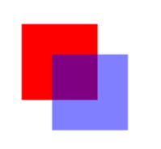

## Canvas

Canvas 是画布，通过 JavaScript 来绘制 2D 图形，是逐像素进行绘制，位置发生改变，就会重新进行绘制。

```HTML
<canvas id="canvas"></canvas>
```

```js
const canvas = document.getElementById("canvas");

// 确保浏览器支持<canvas>
if (canvas.getContext) {
  const ctx = canvas.getContext("2d");

  // 绘制红色矩形
  ctx.fillStyle = "#ff0000";
  ctx.fillRect(10, 10, 50, 50);
  // 绘制半透明蓝色矩形
  ctx.fillStyle = "rgba(0,0,255,0.5)";
  ctx.fillRect(30, 30, 50, 50);
}
```



特点如下：

* 依赖分辨率
* 不支持事件处理器
* 弱的文本渲染能力
* 能够以 .png 或 .jpg 格式保存图片
* 最适合图像密集型的游戏，其中的许多对象会被频繁绘制

## SVG

可缩放矢量图形（Scalable Vector Graphics，SVG）是基于可扩展标记语言 XML 描述的 2D 图形语言，SVG 可以为某个元素附加 JavaScript 事件处理器。

```SVG
<svg version="1.1"
     baseProfile="full"
     width="300" height="200"
     xmlns="http://www.w3.org/2000/svg">

  <rect width="100%" height="100%" fill="red" />

  <circle cx="150" cy="100" r="80" fill="green" />

  <text x="150" y="125" font-size="60" text-anchor="middle" fill="white">SVG</text>

</svg>
```


其特点如下：

* 不依赖分辨率
* 支持事件处理器
* 最适合带有大型渲染区域的应用程序（比如谷歌地图）
* 复杂度高会减慢渲染速度
* 不适合游戏应用