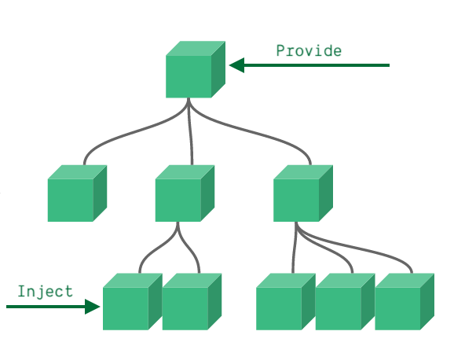

通常，当需要从父组件向子组件传递数据时，我们使用 `props`。但是有一些深度嵌套的组件，而深层的子组件只需要父组件的部分内容。在这种情况下，如果仍然将 `prop` 沿着组件链逐级传递下去，可能会很麻烦。

对于这种情况，我们可以使用一对 `provide` 和 `inject`。无论组件层次结构有多深，父组件都可以作为其所有子组件的依赖提供者。这个特性有两个部分：父组件有一个 `provide` 选项来提供数据，子组件有一个 `inject` 选项来开始使用这些数据。



## 基本使用

如果有一个这样的目录结构：

```bash
App
└─ Home
   └─ HomeContent
```

如果需要在 App 中向 `HomeContent` 传值，我们要将 `prop` 逐级传递下去：`App` -> `Home` -> `HomeContent`。但是通过 `provide/inject` 的方式，我们可以直接执行以下操作：

```vue
<!-- App.vue -->
<template>
  <home></home>
</template>

<script>
import Home from "./Home.vue";

export default {
  components: {
    Home
  },
  provide: {
    name: "wang",
    age: 18
  }
};
</script>
```

```vue
<!-- Home -->
<template>
  <home-content></home-content>
</template>

<script>
import HomeContent from './HomeContent.vue';

export default {
  components: {
    HomeContent
  }
}
</script>
```

```vue
<!-- HomeContent -->
<template>
  <div>
    <!-- HomeContent: wang - 18 -->
    HomeContent: {{name}} - {{age}}
  </div>
</template>

<script>
export default {
  inject: ["name", "age"],
}
</script>
```

## provide 组件实例 property

如果现在修改 `App`，让它 provide 一些组件的实例 property，这会不起作用：

```diff
  <!-- App.vue -->
  <template>
    <home></home>
  </template>
  
  <script>
  import Home from "./Home.vue";
  
  export default {
    components: {
      Home
    },
+   data() {
+     return {
+       content: ["abc", "cab", "bac"]
+     }
+   },
    provide: {
      name: "wang",
      age: 18,
+     length: this.content.length // 这将导致错误：`Cannot read property 'length' of undefined`
    }
  };
  </script>
```

要访问组件实例 property，必须将 `provide` 转换为返回对象的函数：

```diff
  <!-- App.vue -->
  <template>
    <home></home>
  </template>
  
  <script>
  import Home from "./Home.vue";
  
  export default {
    components: {
      Home
    },
    data() {
      return {
        content: ["abc", "cab", "bac"]
      }
    },
-   provide: {
-     name: "wang",
-     age: 18,
-     length: this.content.length // 这将导致错误：`Cannot read property 'length' of undefined`
-   }
+   provide() {
+     return {
+       name: "wang",
+       age: 18,
+       length: this.content.length
+     }
+   }
  };
  </script>
```

## 响应式

虽然上面的修改能够正确注入 `HomeContent`，但是如果更改了 `content` 的内容，这个变化并不会反映在 inject 的 `length` property 中。**因为默认情况下，`provide/inject` 的绑定不是响应式的**。

如果想要将它变成响应式，可以分配一个组合式 API `computed` property：

```js
import { computed } from "vue";

provide() {
  return {
    length: computed(() => this.content.length)
  }
}
```

因为 `computed` 返回的是一个 ref 对象，因此在子组件中需要用 `length.value` 进行调用：

```diff
  <!-- HomeContent -->
  <template>
    <div>
      <!-- HomeContent: wang - 18 -->
-     HomeContent: {{name}} - {{age}} - {{ length }}
+     HomeContent: {{name}} - {{age}} - {{ length.value }}
    </div>
  </template>

  <script>
  export default {
    inject: ["name", "age", "length"],
  }
  </script>
```

经过上述处理，任何对 `content.length` 的改变都会被正确地反映在注入 `length` 的组件中。